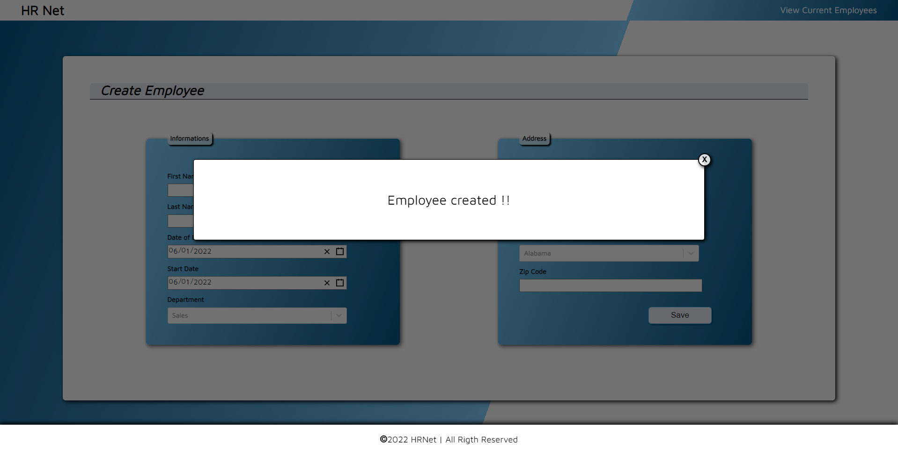

# modale-react-rm

> modale-react-rm library by Romin Manogil
[](https://www.npmjs.com/package/modale-react-rm) [](https://standardjs.com)

## Install

```bash
npm i modale-react-rm
```

## Example

[]("Modale")

## Usage

```jsx
import React from 'react'
const App = () => {
   /* setting the modale*/
   const [isOpen, setIsOpen] = useState(false)
   
   const message = 'Modale is open'
   
   return (
      <div>
         /*example to open up*/
         <button type='button' onClick={setIsOpen(true)}>Save</button>
         <Modale content={message} trigger={isOpen} setTrigger={setIsOpen} />
      </div>
   )
}
export default App
```

## Controllable Props

|Prop name    |Description                                   |Default                         |
|-------------|----------------------------------------------|--------------------------------|
|content      |**_string_** Your message                     |n/a                             |
|trigger      |**_boolean_** Open or close modale            |`false`(closed)                 |
|setTrigger   |cross **_function_** used **_boolean_** params|`() => setTrigger(false)`       |

## More info

The GitHub repository containing this library can be found at:
https://github.com/RominM/modale-react-rm/

## License

MIT © [mglStudio](https://github.com/RominM)